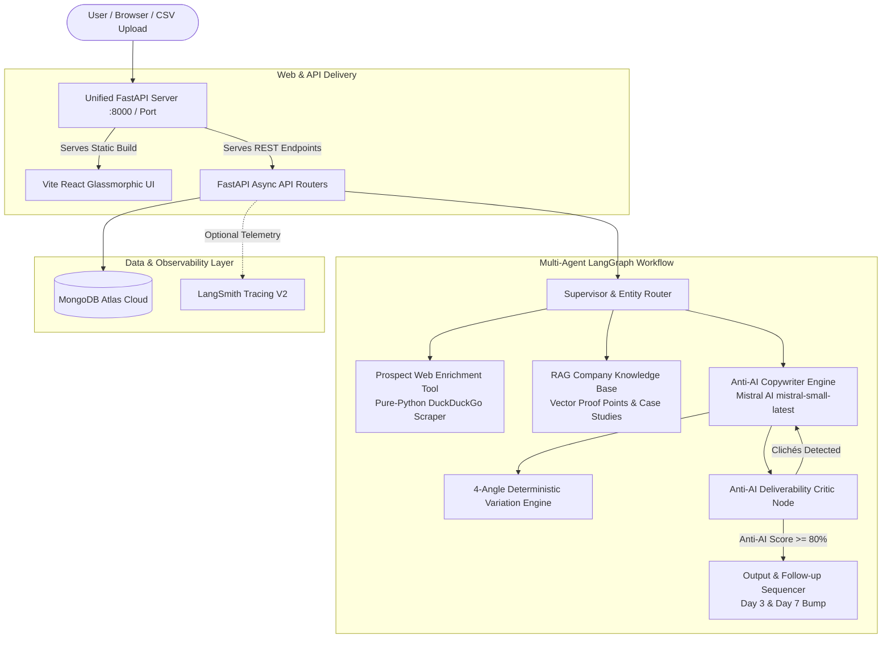

# Cold Outreach Personaliser

> *“Paste a profile, get an email that does not sound AI-generated.”*

🌐 **Live Application**: [https://cold-outreach-personaliser-1.onrender.com/](https://cold-outreach-personaliser-1.onrender.com/)  
📂 **GitHub Repository**: [https://github.com/salman712225/Cold-Outreach-Personaliser.git](https://github.com/salman712225/Cold-Outreach-Personaliser.git)

---

## 📌 Project Overview & Specification

### 🔨 BUILD
Build an application where a user pastes a prospect profile, selects tone and goal, and receives a personalised outreach email with subject line and follow-up message. Batch mode accepts a CSV of prospects and generates a personalised email for every row.

### ⚙️ TECH STACK & TOOLS USED
- **Mistral AI API (`mistral-small-latest`)**: High-performance, anti-AI conversational LLM engine.
- **LangGraph & Multi-Agent Architecture**: Supervisor orchestrator, Copywriter Agent, Anti-AI Deliverability Critic, and Web Enrichment.
- **FastAPI (Python 3.10+)**: High-throughput asynchronous backend server with auto-generated Swagger documentation.
- **Vite + React (Tailwind / Vanilla Glassmorphism)**: Dark-mode UI with live prospect preview, clickable subject line pickers, and real-time human score meters.
- **MongoDB Atlas**: Cloud NoSQL persistence for outreach history, RAG documents, and batch CSV jobs.
- **DuckDuckGo Web Scraper**: Pure-Python zero-cost web enrichment tool without paid third-party dependencies.
- **LangSmith (Optional)**: Observability, telemetry, and evaluation tracing toggleable directly from the UI.
- **`python-dotenv` & Pydantic V2**: Strict environment configuration and runtime schema validation.

### 📦 EXPECTED OUTPUT
- **Single Outreach Mode**: Copy-ready email output with distinct From/To entity separation, clickable A/B/C subject line options, automated Day 3 & Day 7 follow-up sequences, and live Anti-AI Human Score (0–100%).
- **Batch CSV Mode**: Downloadable enriched CSV containing the user's original data with `Generated_Subject`, `Generated_Email`, `Generated_Followup_1`, `Generated_Followup_2`, and `Anti_AI_Score` appended for every prospect row.

---

## 📑 Table of Contents
1. [What It Does?](#-what-it-does)
2. [Problem Statement](#-problem-statement)
3. [The Solution](#-the-solution)
4. [Unified Zero-Delay Architecture](#-unified-zero-delay-architecture)
5. [Environment Variables (`.env`)](#-environment-variables-env)
6. [How to Run It (Local & Cloud Steps)](#-how-to-run-it-local--cloud-steps)
7. [Step-by-Step Implementation Journey](#-step-by-step-implementation-journey)
8. [Testing & Sample Outputs](#-testing--sample-outputs)
9. [Deep-Dive Technical Documentation](#-deep-dive-technical-documentation)
10. [License](#-license)

---

## 🎯 What It Does?

Cold Outreach Personaliser transforms raw unstructured notes, LinkedIn profiles, or academic contexts into authentic, human-sounding emails across diverse real-world domains:

- 🎓 **Student & Academic Communications**: Formal Student Leave Applications (medical emergencies, exam permissions, family obligations), Letters of Recommendation (LOR) requests, and university administrative queries.
- 💼 **Job Applications & Candidate Inquiries**: Tailored candidate outreach for specialized technical roles (e.g., AIML Engineer, Backend Lead) highlighting quantified achievements without robotic filler.
- 🤝 **B2B Outbound Sales & Partnerships**: Value-first outbound emails with low-friction 5-minute CTAs and quantified proof points.
- 🚀 **Founder & Executive Networking**: Peer-to-peer collaboration requests and strategic syncs.
- 📁 **Batch CSV Studio**: Upload a CSV of hundreds of prospects, track real-time row generation progress, inspect individual outputs, and download the enriched CSV.

---

## ⚠️ Problem Statement

### 1. The "AI Slop" Trap
Standard LLM prompts generate emails that immediately trigger spam filters and recipient skepticism:
- Obvious openings: *"I hope this email finds you well"*, *"Hope you're having a great week"*, *"I came across your profile..."*
- Saturated buzzwords: *"delve"*, *"supercharge"*, *"unleash"*, *"cutting-edge"*, *"game-changer"*, *"testament"*, *"spearhead"*.
- High word counts (250+ words) that result in low reply rates (<5%).

### 2. Entity Role Confusion (From vs. To)
Generic outreach generators confuse who is writing and who is receiving. When a student or candidate enters their details, traditional tools frequently address the recipient as the student and sign off with a generic placeholder (e.g., *"Hey Mohammed... Best, Alex"*).

### 3. Repetitive Variation Failure
Clicking "Regenerate" usually results in identical wording or superficial synonym swaps rather than a fresh perspective.

---

## 💡 The Solution

Cold Outreach Personaliser solves these challenges through:

1. **Strict Negative Constraints & Anti-AI Critic Engine**: Scans every draft against 20+ forbidden AI clichés, enforces 6th–8th grade conversational reading levels, and calculates a live **Anti-AI Human Score (0–100%)**.
2. **Explicit Entity Disambiguation (From / Sender vs. To / Recipient)**:
   - **FROM (Sender Details)**: Name, role, and college/company (strictly used for natural self-introductions and sign-offs).
   - **TO (Recipient Details)**: Name, role, and organization (strictly used for polite greetings and contextual hooks).
3. **Guaranteed 4-Angle Deterministic Variation Engine**: Consecutive clicks on **"Generate New Variation"** rotate through 4 distinct structural angles (e.g., Direct Guarantee ➔ Focus on Proof Points ➔ Peer Collaboration ➔ Time-bound Summary).
4. **Unified Zero-Delay Single Service**: The FastAPI backend directly serves the pre-built React frontend. When the web application starts, the backend is **already active immediately** with zero separate startup delay or cross-origin overhead.

---

## 🏗️ Unified Zero-Delay Architecture



---

## ⚙️ Environment Variables (`.env`)

Create a `.env` file in the root or `/backend` directory based on `.env.example`:

```env
# =================================================================
# 1. Mistral AI Configuration (Primary LLM Engine)
# =================================================================
MISTRAL_API_KEY=your_mistral_api_key_here
MISTRAL_MODEL=mistral-small-latest

# =================================================================
# 2. Database Connection (MongoDB Atlas Cloud or Local)
# =================================================================
MONGODB_URI=mongodb+srv://<username>:<password>@cluster0.jhhphys.mongodb.net/?appName=Cluster0
MONGODB_DB_NAME=cold_outreach_db

# =================================================================
# 3. Optional LangSmith Observability & Tracing (Toggleable in UI)
# =================================================================
LANGCHAIN_TRACING_V2=false
LANGCHAIN_API_KEY=lsv2_pt_...
LANGCHAIN_PROJECT=cold-outreach-personaliser
LANGCHAIN_ENDPOINT=https://api.smith.langchain.com

# =================================================================
# 4. JWT Authentication & Security
# =================================================================
JWT_SECRET=super_secret_jwt_key_change_in_production_987654321
JWT_ALGORITHM=HS256
ACCESS_TOKEN_EXPIRE_MINUTES=1440

# =================================================================
# 5. Server Configuration
# =================================================================
HOST=0.0.0.0
PORT=8000
```

---

## 🚀 How to Run It (Local & Cloud Steps)

### 1. Prerequisites
- **Python**: 3.10 or higher
- **Node.js**: 18+ and npm
- **Git**

---

### 2. Quick 1-Click Startup (Frontend + Backend Together)

#### Windows:
Double-click `start.bat` or run:
```cmd
start.bat
```

#### macOS / Linux / Unified npm:
```bash
npm run dev
```
*This command automatically compiles the frontend bundle and starts the unified FastAPI backend on `http://localhost:8000` (serving both the website UI and API endpoints together).*

---

### 3. Step-by-Step Manual Local Run

#### Step A: Clone Repository
```bash
git clone https://github.com/salman712225/Cold-Outreach-Personaliser.git
cd Cold-Outreach-Personaliser
```

#### Step B: Install Frontend & Build Static Dist
```bash
cd frontend
npm install
npm run build
cd ..
```

#### Step C: Run Unified Backend
```bash
cd backend
python -m venv venv

# Windows:
.\venv\Scripts\activate
# macOS/Linux:
source venv/bin/activate

pip install -r requirements.txt
python -m uvicorn main:app --host 127.0.0.1 --port 8000 --reload
```
*Open **`http://localhost:8000`** in your browser to view the application.*

---

### 4. Cloud Deployment on Render

The repository includes a [`render.yaml`](./render.yaml) blueprint:

1. Go to [Render Dashboard](https://dashboard.render.com).
2. Click **New +** ➔ **Blueprint**.
3. Select your repository: `salman712225/Cold-Outreach-Personaliser`.
4. Render automatically configures the single unified web service:
   - **Build Command**: `cd frontend && npm install && npm run build && cd ../backend && pip install -r requirements.txt`
   - **Start Command**: `cd backend && python -m uvicorn main:app --host 0.0.0.0 --port $PORT`
5. Enter your `MISTRAL_API_KEY` and `MONGODB_URI` when prompted.
6. Click **Apply** to deploy.

---

## 🛠️ Step-by-Step Implementation Journey

### Phase 1: Architecture & Entity Schema Separation
- Designed Pydantic V2 models explicitly distinguishing **Sender (From)** from **Recipient (To)** to resolve naming hallucinations.

### Phase 2: Mistral AI (`mistral-small-latest`) Engine
- Integrated resilient asynchronous `httpx` Mistral API communication with anti-sycophancy negative system prompts.

### Phase 3: Multi-Agent Anti-AI Deliverability Critic
- Built automated rule evaluation filtering 20+ forbidden AI tokens and scoring drafts for human reading cadence.
- Implemented automated 2-step follow-up sequences (Day 3 polite bump & Day 7 polite breakup).

### Phase 4: Deterministic 4-Angle Variation Engine
- Formulated rotating seed logic `variant_seed = ((seed - 1) % 4) + 1` ensuring consecutive clicks produce visibly distinct angles and subject lines.

### Phase 5: MongoDB Atlas Cloud & Batch CSV Studio
- Configured asynchronous `motor` connection with automated fallback handling.
- Implemented batch CSV processor preserving original column mappings while appending generated output columns.

### Phase 6: Unified Zero-Delay Static Serving
- Enhanced FastAPI backend to mount and serve pre-built Vite React static assets directly on the root path, eliminating separate backend startup delay and CORS overhead in production.

---

## 🧪 Testing & Sample Outputs

### Automated Verification Script
Run the built-in test runner from `/backend`:

```bash
python -c "
from app.agents.copywriter import generate_dynamic_fallback

res = generate_dynamic_fallback(
    prospect_name='Dr. Sharma',
    prospect_company='Crescent Institute',
    prospect_role='HOD & Professor',
    profile_text='Professor overseeing B.Tech coursework.',
    tone='Formal & Respectful',
    goal='Leave Application / Permission',
    value_proposition='Severe viral fever requiring 3 days medical rest.',
    sender_name='Mohammed Salman',
    sender_role='B.Tech Student',
    sender_company='Crescent Institute',
    recipient_name='Dr. Sharma',
    recipient_company='Crescent Institute',
    recipient_role='HOD',
    variation_count=1
)
print('Subject:', res['selected_subject'])
print('Body:\n' + res['email_body'])
"
```

### Sample Outputs

#### 1. Student Leave Application (Formal Academic)
```text
Subject: Leave Application - Mohammed Salman (Crescent Institute)

Respected Dr. Sharma,

I am writing to formally request a leave of absence from Crescent Institute due to severe viral fever requiring 3 days of medical rest (Oct 12 to Oct 15).

I will ensure that all my pending coursework and assignments are caught up upon my return, and I remain reachable via email should any urgent matter arise.

Kindly consider my request and grant permission for the indicated duration.

Thank you for your understanding.

Sincerely,
Mohammed Salman
B.Tech CSE Student, Crescent Institute
```

#### 2. AIML Candidate Job Application
```text
Subject: Application / Note re: AIML development at DataMatrix AI

Dear Hiring Manager,

Following DataMatrix AI's technical roadmap in AIML development with great interest.

I'm Mohammed Salman, an AIML Candidate & Graduate at Crescent Institute. Over the past few months, I've focused on how teams can cut cloud vector database compute costs by 52% with semantic deduplication.

Would you be open to a brief 5-minute conversation regarding the opportunity?

All the best,
Mohammed Salman
AIML Candidate & Graduate, Crescent Institute
```

---

## 🔬 Deep-Dive Technical Documentation

### API Endpoints Reference

| Method | Endpoint | Description | Auth Required |
| :--- | :--- | :--- | :--- |
| `GET` | `/api/health` | Returns server health, model status, and MongoDB state | No |
| `POST` | `/api/auth/register` | Register new user account | No |
| `POST` | `/api/auth/login` | Authenticate user and issue JWT token | No |
| `GET` | `/api/auth/me` | Fetch authenticated user profile | Yes |
| `POST` | `/api/outreach/generate` | Generate Anti-AI email, subjects, follow-ups & score | Yes / Guest |
| `POST` | `/api/batch/upload` | Upload CSV and generate batch emails | Yes / Guest |
| `GET` | `/api/batch/status/{job_id}` | Poll batch processing status | Yes / Guest |
| `GET` | `/api/batch/download/{job_id}`| Export enriched results as downloadable CSV | Yes / Guest |
| `GET` | `/api/history/list` | Retrieve generation history from MongoDB | Yes / Guest |

### Anti-AI Forbidden Clichés Matrix

The Deliverability Critic node detects and eliminates these clichés:

```json
[
  "I hope this email finds you well",
  "Hope you're having a great week",
  "In today's fast-paced world",
  "game-changer",
  "supercharge",
  "unleash",
  "delve",
  "cutting-edge",
  "testament",
  "spearhead",
  "seamlessly",
  "synergy"
]
```

---

## 📄 License

This project is open-source and licensed under the **MIT License** — see the [LICENSE](LICENSE) file for details.
