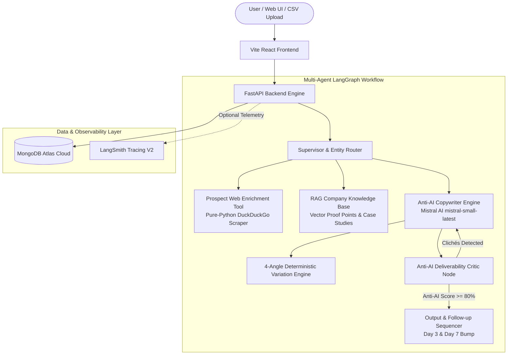

# ColdReach.ai — Anti-AI Universal Email & Cold Outreach Personaliser

> *"Paste a profile or context, get an email that does NOT sound AI-generated."*

ColdReach.ai is an enterprise-grade universal email personalization and cold outreach engine powered by **Mistral AI (`mistral-small-latest`)**, **LangGraph Multi-Agent Workflows**, **MongoDB Atlas**, and **Vite + React**. 

It eliminates sycophantic AI fluff, robot buzzwords, and template clichés in favor of natural conversational cadence, distinct entity separation (From / Sender vs. To / Recipient), and guaranteed rotating variation angles for every domain.

---

## 📑 Table of Contents
1. [What It Does?](#-what-it-does)
2. [Problem Statement](#-problem-statement)
3. [The Solution](#-the-solution)
4. [Core Architecture](#-core-architecture)
5. [Environment Variables (`.env`)](#-environment-variables-env)
6. [How to Run It (Local & Cloud Steps)](#-how-to-run-it-local--cloud-steps)
7. [Step-by-Step Implementation Journey](#-step-by-step-implementation-journey)
8. [Testing & Verification](#-testing--verification)
9. [Deep-Dive Technical Documentation](#-deep-dive-technical-documentation)
10. [License](#-license)

---

## 🎯 What It Does?

ColdReach.ai transforms unstructured notes, LinkedIn summaries, or job descriptions into authentic, human-sounding emails across diverse real-world contexts:

- 🎓 **Student & Academic Communications**: Student Leave Applications (medical, urgent, family), Letters of Recommendation (LOR) requests, and college administrative inquiries.
- 💼 **Career & Job Applications**: Tailored candidate outreach for high-demand technical roles (e.g., AIML Engineer, Backend Lead) with quantified project achievements.
- 🤝 **B2B Partnerships & Outbound Sales**: High-converting, peer-to-peer outreach with low-friction 5-minute CTAs and quantified ROI proof points.
- 🚀 **Founder & Executive Networking**: Relatable startup collaborations and peer-to-peer observations without salesy pushiness.
- 📁 **Batch CSV Studio**: Upload a CSV of hundreds of prospects, track real-time generation progress, and download the original data enriched with `Generated_Subject`, `Generated_Email`, `Generated_Followup_1`, `Generated_Followup_2`, and `Anti_AI_Score`.

---

## ⚠️ Problem Statement

### 1. The "AI Slop" Trap
Traditional LLM-generated emails suffer from obvious dead giveaways:
- Robotic openers: *"I hope this email finds you well"*, *"Hope you're having a great week"*, *"I came across your profile..."*
- Saturated buzzwords: *"delve"*, *"supercharge"*, *"unleash"*, *"cutting-edge"*, *"game-changer"*, *"testament"*, *"spearhead"*.
- High word counts (250+ words) leading to spam filters, low open rates (<15%), and instant unsubscribes.

### 2. Entity Role Confusion (From vs. To)
Most outreach generators confuse the **sender** and the **recipient**. When a student or candidate enters their own name, traditional tools mistakenly address the recipient as the student and sign off with a generic placeholder (e.g., *"Hey Mohammed... Best, Alex"*).

### 3. Repetitive Variation Failure
Clicking "Regenerate" or "Generate New Variation" often produces the exact same template or minor synonymous swaps instead of a fresh conceptual angle.

---

## 💡 The Solution

ColdReach.ai solves these challenges through:

1. **Strict Negative Constraints & Anti-AI Critic Engine**: A multi-agent evaluation node scans every generated draft against 20+ forbidden AI clichés, enforces 6th–8th grade conversational reading levels, and computes a live **Anti-AI Human Score (0–100%)**.
2. **Explicit Entity Disambiguation (From / Sender vs. To / Recipient)**:
   - **FROM (Sender)**: Your name, role, and college/company (used for natural self-introductions and sign-offs).
   - **TO (Recipient)**: Prospect/Professor name, role, and organization (used for polite greetings and contextual hooks).
3. **Guaranteed 4-Angle Deterministic Variation Engine**: Every click on **"Generate New Variation"** cycles through distinct perspectives (e.g., Direct Coursework Guarantee ➔ Medical Rest Focus ➔ Peer Notes Catchup ➔ Time-bound Return Schedule).
4. **Lightweight & Universal Stack**: Powered by **Mistral AI (`mistral-small-latest`)** with zero mandatory third-party dependencies, asynchronous **MongoDB Atlas** persistence, and optional **LangSmith** telemetry.

---

## 🏗️ Core Architecture



---

## ⚙️ Environment Variables (`.env`)

Create a `.env` file in the root or `/backend` directory based on `.env.example`:

```env
# =================================================================
# 1. Mistral AI Configuration (Primary LLM Engine)
# =================================================================
MISTRAL_API_KEY=your_mistral_api_key_here
MISTRAL_MODEL=mistral-small-latest

# =================================================================
# 2. Database Connection (MongoDB Atlas Cloud or Local)
# =================================================================
MONGODB_URI=mongodb+srv://<username>:<password>@cluster0.jhhphys.mongodb.net/?appName=Cluster0
MONGODB_DB_NAME=cold_outreach_db

# =================================================================
# 3. Optional LangSmith Observability & Tracing (Configurable in UI)
# =================================================================
LANGCHAIN_TRACING_V2=false
LANGCHAIN_API_KEY=lsv2_pt_...
LANGCHAIN_PROJECT=cold-outreach-personaliser
LANGCHAIN_ENDPOINT=https://api.smith.langchain.com

# =================================================================
# 4. JWT Authentication & Security
# =================================================================
JWT_SECRET=super_secret_jwt_key_change_in_production_987654321
JWT_ALGORITHM=HS256
ACCESS_TOKEN_EXPIRE_MINUTES=1440

# =================================================================
# 5. Server Configuration
# =================================================================
HOST=0.0.0.0
PORT=8000
```

---

## 🚀 How to Run It (Local & Cloud Steps)

### 1. Prerequisites
- **Python**: 3.10+ installed
- **Node.js**: 18+ and npm installed
- **Git**

---

### 2. Local Development Setup

#### Step A: Clone Repository
```bash
git clone https://github.com/salman712225/Cold-Outreach-Personaliser.git
cd Cold-Outreach-Personaliser
```

#### Step B: Run Backend (FastAPI)
```bash
cd backend
python -m venv venv

# Windows:
.\venv\Scripts\activate
# macOS/Linux:
# source venv/bin/activate

pip install -r requirements.txt
python -m uvicorn main:app --host 127.0.0.1 --port 8000 --reload
```
*Backend API & Interactive Swagger Docs will run at `http://localhost:8000/docs`.*

#### Step C: Run Frontend (Vite + React)
```bash
# In a new terminal:
cd frontend
npm install
npm run dev
```
*Open **`http://localhost:5173`** in your browser.*

---

### 3. Cloud Deployment on Render (Automated Blueprint)

This repository includes a [`render.yaml`](./render.yaml) configuration file for one-click deployment:

1. Log in to [Render Dashboard](https://dashboard.render.com).
2. Click **New +** ➔ **Blueprint**.
3. Connect your repository: `salman712225/Cold-Outreach-Personaliser`.
4. Render automatically configures:
   - **Backend Web Service** (`cold-outreach-backend` on Python 3 with `uvicorn main:app --host 0.0.0.0 --port $PORT`).
   - **Frontend Static Site** (`cold-outreach-frontend` with `npm install && npm run build` and publish dir `dist`).
5. Set your `MISTRAL_API_KEY` and `MONGODB_URI` environment variables in the Render prompt.
6. Click **Apply** to deploy.

---

## 🛠️ Step-by-Step Implementation Journey

### Phase 1: Architecture & Entity Schema Design
- Defined strict schemas separating **Sender (From)** from **Recipient (To)** in Pydantic models.
- Established JSON-contract enforcement between frontend and backend.

### Phase 2: Mistral AI (`mistral-small-latest`) Integration
- Built zero-crash resilience with asynchronous `httpx` client calls.
- Designed system prompts forbidding sycophancy, AI clichés, and formatting artifacts.

### Phase 3: Multi-Agent Anti-AI Critic Engine
- Developed the **Critic Evaluator Node** to scan for banned tokens and calculate the Flesch-Kincaid / conversational readability score.
- Structured automated 2-step follow-up sequence generation (Day 3 polite bump & Day 7 polite breakup).

### Phase 4: Entity Disambiguation (From vs. To)
- Eliminated entity confusion by ensuring the greeting addresses the recipient (e.g., `Respected Dr. Sharma,`) and the sign-off strictly reflects the sender (e.g., `Mohammed Salman \n B.Tech Student, Crescent Institute`).

### Phase 5: 4-Angle Guaranteed Deterministic Rotating Variations
- Built 4 distinct perspective angles for every domain, ensuring that clicking "Generate New Variation (#2, #3, #4)" deterministically cycles to fresh hooks, phrasing, and subject lines.

### Phase 6: MongoDB Atlas Persistence & Batch CSV Processing
- Integrated `motor` asynchronous MongoDB client with fallback handling.
- Implemented batch CSV ingestion and export preserving original columns while adding generated subjects, emails, and follow-ups.

### Phase 7: UI/UX Studio & Production Packaging
- Created a dark-mode glassmorphic interface with clickable subject line selectors, real-time token metrics, sample persona presets, and `render.yaml` deployment blueprints.

---

## 🧪 Testing & Verification

### Automated Verification Script
Run the built-in end-to-end verification script from the `/backend` folder:

```bash
python -c "
from app.agents.copywriter import generate_dynamic_fallback

# Test Student Leave Letter
r1 = generate_dynamic_fallback(
    prospect_name='Dr. Sharma',
    prospect_company='Crescent Institute',
    prospect_role='HOD & Professor',
    profile_text='Professor overseeing B.Tech coursework.',
    tone='Formal & Respectful',
    goal='Leave Application / Permission',
    value_proposition='Severe viral fever requiring 3 days medical rest.',
    sender_name='Mohammed Salman',
    sender_role='B.Tech Student',
    sender_company='Crescent Institute',
    recipient_name='Dr. Sharma',
    recipient_company='Crescent Institute',
    recipient_role='HOD',
    variation_count=1
)
print('Subject:', r1['selected_subject'])
print('Body:\n' + r1['email_body'])
"
```

### Sample Outputs

#### 1. Student Leave Letter (Formal Academic)
```text
Subject: Leave Application - Mohammed Salman (Crescent Institute)

Respected Dr. Sharma,

I am writing to formally request a leave of absence from Crescent Institute due to severe viral fever requiring 3 days of medical rest (Oct 12 to Oct 15).

I will ensure that all my pending coursework and assignments are caught up upon my return, and I remain reachable via email should any urgent matter arise.

Kindly consider my request and grant permission for the indicated duration.

Thank you for your understanding.

Sincerely,
Mohammed Salman
B.Tech CSE Student, Crescent Institute
```

#### 2. AIML Candidate Job Application
```text
Subject: Application / Note re: AIML development at DataMatrix AI

Dear Hiring Manager,

Following DataMatrix AI's technical roadmap in AIML development with great interest.

I'm Mohammed Salman, an AIML Candidate & Graduate at Crescent Institute. Over the past few months, I've focused on how teams can cut cloud vector database compute costs by 52% with semantic deduplication.

Would you be open to a brief 5-minute conversation regarding the opportunity?

All the best,
Mohammed Salman
AIML Candidate & Graduate, Crescent Institute
```

---

## 🔬 Deep-Dive Technical Documentation

### API Endpoints Reference

| Method | Endpoint | Description | Auth Required |
| :--- | :--- | :--- | :--- |
| `GET` | `/api/health` | Returns server health, model status, MongoDB state | No |
| `POST` | `/api/auth/register` | Register new user account | No |
| `POST` | `/api/auth/login` | Login and obtain JWT bearer token | No |
| `GET` | `/api/auth/me` | Fetch authenticated user profile | Yes |
| `POST` | `/api/outreach/generate` | Generate Anti-AI email, subjects, follow-ups & score | Yes / Guest |
| `POST` | `/api/batch/upload` | Upload CSV and generate batch emails | Yes / Guest |
| `GET` | `/api/batch/export/{job_id}` | Export batch results as downloadable CSV | Yes / Guest |
| `GET` | `/api/history` | Retrieve saved generation history from MongoDB | Yes / Guest |

### Anti-AI Forbidden Clichés Matrix

The Critic Agent actively filters and penalizes the following patterns:

```json
[
  "I hope this email finds you well",
  "Hope you're having a great week",
  "In today's fast-paced world",
  "game-changer",
  "supercharge",
  "unleash",
  "delve",
  "cutting-edge",
  "testament",
  "spearhead",
  "seamlessly",
  "synergy"
]
```

---

## 📄 License

This project is licensed under the **MIT License** — see the [LICENSE](LICENSE) file for details.
