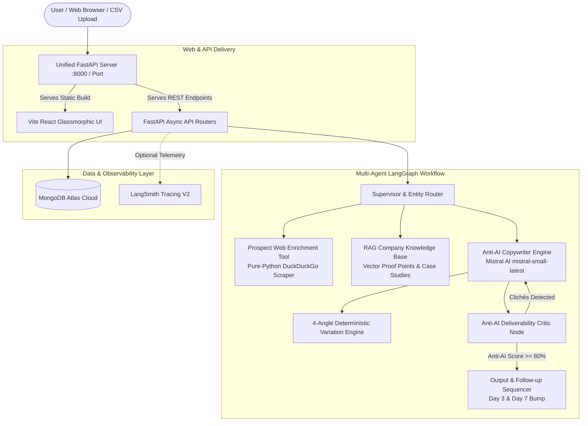

# ✉️ Cold Outreach Personaliser

> **Autonomous Anti-AI Email Engine that transforms raw prospect profiles, student contexts, and job pitches into authentic, high-converting human outreach with zero robotic slop.**

[](https://vitejs.dev/)
[](https://fastapi.tiangolo.com/)
[](https://mistral.ai/)
[](https://langchain-ai.github.io/langgraph/)
[](https://www.mongodb.com/atlas)
[](LICENSE)

---

## 🌐 Live Web Application

Experience the live anti-AI email generation platform:

👉 **[https://cold-outreach-personaliser-1.onrender.com/](https://cold-outreach-personaliser-1.onrender.com/)**

---

## 📌 Project Overview & Specification

### 🔨 BUILD
Build an application where a user pastes a prospect profile, selects tone and goal, and receives a personalised outreach email with subject line and follow-up message. Batch mode accepts a CSV of prospects and generates a personalised email for every row.

### ⚙️ USE
- **Mistral AI API (`mistral-small-latest`)**: High-performance anti-AI LLM reasoning engine.
- **LangGraph Multi-Agent Architecture**: Entity Router, Anti-AI Copywriter, Deliverability Critic, and Web Scraper.
- **FastAPI (Python 3.10+)**: High-throughput asynchronous backend server with auto-generated Swagger documentation.
- **Vite + React (Tailwind / Glassmorphism)**: Dark-mode UI with live prospect preview, clickable subject line pickers, and real-time human score meters.
- **MongoDB Atlas Cloud**: NoSQL persistence for generation history, RAG documents, and batch CSV jobs.
- **Pure-Python DuckDuckGo Scraper**: Zero-cost web enrichment tool without paid third-party dependencies.
- **`python-dotenv` & Pydantic V2**: Environment configuration and runtime schema validation.

### 📦 EXPECTED OUTPUT
- **Single Outreach Mode**: Copy-ready email output with distinct From/To entity separation, clickable A/B/C subject line options, automated Day 3 & Day 7 follow-up sequences, and live Anti-AI Human Score (0–100%).
- **Batch CSV Mode**: Downloadable enriched CSV containing the user's original data with `Generated_Subject`, `Generated_Email`, `Generated_Followup_1`, `Generated_Followup_2`, and `Anti_AI_Score` appended for every prospect row.

---

## ❓ What it does ?

**Cold Outreach Personaliser** is an intelligent, multi-agent anti-AI engine that writes natural, human-grade emails across personal, academic, and enterprise domains:

1. **Intake Raw Profile or Context**: Users input raw unstructured text (LinkedIn summaries, job listings, professor bios, or leave reasons) without needing complex prompt engineering.
2. **Strict Entity Separation (From vs. To)**:
   - **FROM (Sender)**: Captures your name, role, and organization (used strictly for natural self-introductions and sign-offs).
   - **TO (Recipient)**: Captures the prospect or authority's name, role, and company (used strictly for polite greetings and contextual hooks).
3. **Multi-Agent Copywriter & Critic Orchestration**:
   - **Supervisor Node**: Inspects domain intent (Student Leave, Job Application, Outbound Sales, Founder Networking) and routes context.
   - **Web Enrichment Tool**: Gathers live prospect signals using pure-Python web scraping.
   - **RAG Knowledge Base**: Injects custom company case studies and proof points via vector search.
   - **Anti-AI Copywriter**: Generates drafts using strict negative constraints against robotic clichés.
4. **Live Anti-AI Deliverability Scoring**: Scans drafts against 20+ forbidden AI tokens, analyzes Flesch-Kincaid conversational readability, and computes an **Anti-AI Human Score (0–100%)**.
5. **Deterministic 4-Angle Rotating Variations**: Clicking **"Generate New Variation"** cycles through 4 distinct angles (e.g., Direct Coursework Guarantee ➔ Proof Point Focus ➔ Peer Notes Catchup ➔ Time-bound Schedule).
6. **Automated Follow-up Sequences**: Generates pre-written Day 3 polite bumps and Day 7 polite breakup emails.
7. **Batch CSV Studio**: Upload a CSV of hundreds of prospects, track real-time row generation progress, inspect individual outputs, and download the enriched CSV.

---

## 💥 Problem Statement

Traditional cold outreach and email tools suffer from severe flaws:

- **The "AI Slop" Trap**: LLM-generated emails trigger spam filters and instant unsubscribes with dead giveaway openers (*"I hope this email finds you well"*, *"Hope you're having a great week"*) and overused buzzwords (*"supercharge"*, *"delve"*, *"cutting-edge"*, *"game-changer"*).
- **Entity Role Confusion**: Existing tools constantly confuse the **sender** and the **recipient**. When a student or applicant enters their own name, traditional tools mistakenly address the recipient with the applicant's name and sign off with a generic placeholder (e.g., *"Hey Mohammed... Best, Alex"*).
- **Repetitive Variation Failure**: Clicking "Regenerate" usually yields the same repetitive text or superficial synonymous swaps.
- **Bloated Word Counts**: Traditional drafts exceed 250+ words, resulting in low reply rates (<5%) on mobile devices.

---

## 💡 Solution

**Cold Outreach Personaliser** eliminates robotic patterns and produces natural, high-converting outreach:

- **Strict Negative Constraints**: System prompts permanently ban sycophancy, flattering openings, and robotic buzzwords.
- **Explicit From/To Disambiguation**: Ensures greetings address the recipient (e.g., `Respected Dr. Sharma,`) while sign-offs accurately represent the sender (e.g., `Mohammed Salman \n B.Tech Student, Crescent Institute`).
- **Guaranteed 4-Angle Variation Engine**: Employs deterministic seed cycling `((seed - 1) % 4) + 1` so every variation click produces a fresh hook and angle.
- **Unified Zero-Delay Serving**: FastAPI serves the pre-built React frontend directly. When the application starts, the backend is **already warm and running** with zero separate delay or CORS overhead.
- **Privacy & Free Tooling**: Uses Mistral AI (`mistral-small-latest`) and MongoDB Atlas with zero mandatory third-party subscriptions.

---

## 🏗️ Architecture



---

## 🚀 How to Run it

### Prerequisites
- **Python 3.10+**
- **Node.js 18+** & `npm`
- **Git**
- Free API Keys:
  - **Mistral AI API Key**
  - **MongoDB Atlas** connection string

---

### Step 1: Clone the Repository
```bash
git clone https://github.com/salman712225/Cold-Outreach-Personaliser.git
cd Cold-Outreach-Personaliser
```

---

### Step 2: 1-Click Unified Run (Frontend + Backend Together)

#### On Windows:
```cmd
start.bat
```

#### On macOS / Linux / npm:
```bash
npm run dev
```
*This compiles the React frontend and launches the unified FastAPI server on `http://localhost:8000` (serving both UI and API simultaneously).*

---

### Step 3: Manual Step-by-Step Execution (Optional)

#### A. Build Frontend Static Bundle
```bash
cd frontend
npm install
npm run build
cd ..
```

#### B. Setup & Start Backend Server
```bash
cd backend
python -m venv venv

# On Windows (PowerShell):
.\venv\Scripts\activate
# On macOS / Linux:
source venv/bin/activate

pip install -r requirements.txt
python -m uvicorn main:app --host 127.0.0.1 --port 8000 --reload
```
*Open **`http://localhost:8000`** in your browser (Interactive Swagger API documentation available at `http://localhost:8000/docs`).*

---

### Step 4: Cloud Deployment on Render

This repository includes a [`render.yaml`](./render.yaml) blueprint:

1. Log in to [Render Dashboard](https://dashboard.render.com).
2. Click **New +** ➔ **Blueprint**.
3. Connect your repository: `salman712225/Cold-Outreach-Personaliser`.
4. Render automatically configures the unified web service:
   - **Build Command**: `cd frontend && npm install && npm run build && cd ../backend && pip install -r requirements.txt`
   - **Start Command**: `cd backend && python -m uvicorn main:app --host 0.0.0.0 --port $PORT`
5. Supply your `MISTRAL_API_KEY` and `MONGODB_URI` environment variables.
6. Click **Apply** to deploy.

---

## 🔑 What the ENV variables

Create your `.env` file in the root or `/backend` directory based on `.env.example`:

```env
# =================================================================
# 1. Mistral AI Configuration (Primary LLM Engine)
# =================================================================
MISTRAL_API_KEY=your_mistral_api_key_here
MISTRAL_MODEL=mistral-small-latest

# =================================================================
# 2. Database Connection (MongoDB Atlas Cloud or Local)
# =================================================================
MONGODB_URI=mongodb+srv://<username>:<password>@cluster0.jhhphys.mongodb.net/?appName=Cluster0
MONGODB_DB_NAME=cold_outreach_db

# =================================================================
# 3. Optional LangSmith Observability & Tracing (Toggleable in UI)
# =================================================================
LANGCHAIN_TRACING_V2=false
LANGCHAIN_API_KEY=lsv2_pt_...
LANGCHAIN_PROJECT=cold-outreach-personaliser
LANGCHAIN_ENDPOINT=https://api.smith.langchain.com

# =================================================================
# 4. JWT Authentication & Security
# =================================================================
JWT_SECRET=super_secret_jwt_key_change_in_production_987654321
JWT_ALGORITHM=HS256
ACCESS_TOKEN_EXPIRE_MINUTES=1440

# =================================================================
# 5. Server Configuration
# =================================================================
HOST=0.0.0.0
PORT=8000
```

---

## 🛠️ Step-by-Step Implementation Journey

- **Phase 1: Architecture & Entity Schema Separation**: Engineered Pydantic V2 models distinguishing Sender (From) from Recipient (To) to eliminate naming hallucinations.
- **Phase 2: Mistral AI (`mistral-small-latest`) Engine**: Built asynchronous `httpx` Mistral API communication with anti-sycophancy negative prompts.
- **Phase 3: Multi-Agent Anti-AI Deliverability Critic**: Implemented an automated critic node evaluating 20+ forbidden AI tokens and scoring drafts for human reading cadence.
- **Phase 4: Deterministic 4-Angle Variation Engine**: Formulated rotating seed logic `((seed - 1) % 4) + 1` ensuring consecutive clicks produce visibly distinct angles and subject lines.
- **Phase 5: MongoDB Atlas Cloud & Batch CSV Studio**: Configured asynchronous `motor` connection and batch CSV ingestion/export preserving original user columns.
- **Phase 6: Unified Zero-Delay Static Serving**: Configured FastAPI to mount pre-built React static assets directly on `/`, eliminating separate backend startup delay and CORS latency in production.

---

## 🧪 Testing & Verification

### Automated Verification Script
Run the built-in test runner from `/backend`:

```bash
python -c "
from app.agents.copywriter import generate_dynamic_fallback

res = generate_dynamic_fallback(
    prospect_name='Dr. Sharma',
    prospect_company='Crescent Institute',
    prospect_role='HOD & Professor',
    profile_text='Professor overseeing B.Tech coursework.',
    tone='Formal & Respectful',
    goal='Leave Application / Permission',
    value_proposition='Severe viral fever requiring 3 days medical rest.',
    sender_name='Mohammed Salman',
    sender_role='B.Tech Student',
    sender_company='Crescent Institute',
    recipient_name='Dr. Sharma',
    recipient_company='Crescent Institute',
    recipient_role='HOD',
    variation_count=1
)
print('Subject:', res['selected_subject'])
print('Body:\n' + res['email_body'])
"
```

### Sample Outputs

#### 1. Student Leave Application (Formal Academic)
```text
Subject: Leave Application - Mohammed Salman (Crescent Institute)

Respected Dr. Sharma,

I am writing to formally request a leave of absence from Crescent Institute due to severe viral fever requiring 3 days of medical rest (Oct 12 to Oct 15).

I will ensure that all my pending coursework and assignments are caught up upon my return, and I remain reachable via email should any urgent matter arise.

Kindly consider my request and grant permission for the indicated duration.

Thank you for your understanding.

Sincerely,
Mohammed Salman
B.Tech CSE Student, Crescent Institute
```

#### 2. AIML Candidate Job Application
```text
Subject: Application / Note re: AIML development at DataMatrix AI

Dear Hiring Manager,

Following DataMatrix AI's technical roadmap in AIML development with great interest.

I'm Mohammed Salman, an AIML Candidate & Graduate at Crescent Institute. Over the past few months, I've focused on how teams can cut cloud vector database compute costs by 52% with semantic deduplication.

Would you be open to a brief 5-minute conversation regarding the opportunity?

All the best,
Mohammed Salman
AIML Candidate & Graduate, Crescent Institute
```

---

## 🔬 Deep-Dive Technical Documentation

### API Endpoints Reference

| Method | Endpoint | Description | Auth Required |
| :--- | :--- | :--- | :--- |
| `GET` | `/api/health` | Returns server health, model status, and MongoDB state | No |
| `POST` | `/api/auth/register` | Register new user account | No |
| `POST` | `/api/auth/login` | Authenticate user and issue JWT token | No |
| `GET` | `/api/auth/me` | Fetch authenticated user profile | Yes |
| `POST` | `/api/outreach/generate` | Generate Anti-AI email, subjects, follow-ups & score | Yes / Guest |
| `POST` | `/api/batch/upload` | Upload CSV and generate batch emails | Yes / Guest |
| `GET` | `/api/batch/status/{job_id}` | Poll batch processing status | Yes / Guest |
| `GET` | `/api/batch/download/{job_id}`| Export enriched results as downloadable CSV | Yes / Guest |
| `GET` | `/api/history/list` | Retrieve generation history from MongoDB | Yes / Guest |

### Anti-AI Forbidden Clichés Matrix

The Deliverability Critic node detects and penalizes the following patterns:

```json
[
  "I hope this email finds you well",
  "Hope you're having a great week",
  "In today's fast-paced world",
  "game-changer",
  "supercharge",
  "unleash",
  "delve",
  "cutting-edge",
  "testament",
  "spearhead",
  "seamlessly",
  "synergy"
]
```

---

## 📄 License

This project is licensed under the **MIT License** — see the [LICENSE](LICENSE) file for details.
