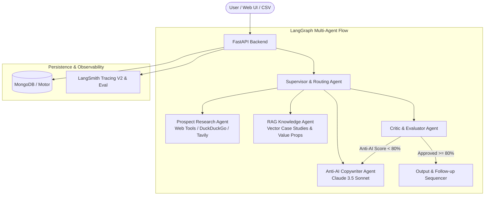

# ColdReach.ai — Anti-AI Cold Outreach Personaliser

> *"Paste a prospect profile, get an email that does NOT sound AI-generated."*

ColdReach.ai is an enterprise-grade cold outreach personalization engine designed to generate high-converting, natural, conversational cold emails and multi-step follow-up sequences that pass deliverability checks and sound 100% human.

Powered by **Anthropic Claude (3.5 Sonnet / Haiku)**, **LangGraph Multi-Agent Architecture**, **RAG (Retrieval-Augmented Generation)**, **FastAPI**, **MongoDB**, and **LangSmith Tracing & Evaluation**.

---

## 📸 Key Features

- 👤 **Single Outreach Studio**: Paste raw LinkedIn bio, company notes, or select curated sample personas. Pick tone, goal, and value proposition.
- 🚫 **Strict Anti-AI Humanizer**: Completely eliminates generic AI dead giveaways (*"I hope this email finds you well"*, *"In today's fast-paced digital world"*, *"delve"*, *"cutting-edge"*, *"supercharge"*) in favor of punchy 6th–8th grade conversational cadence.
- 🔀 **A/B Subject Line Generator & 2-Step Sequence**: Generates lowercase/sentence-case high-open subject lines, full email body, Day 3 follow-up bump, and Day 7 polite breakup email.
- 📊 **Anti-AI Score & Critic Inspector**: Real-time deliverability score (0–100%), AI cliché scanner, spam trigger detector, and readability metrics.
- 📁 **Batch CSV Studio**: Upload a CSV of hundreds of prospects, track live row-by-row progress, and export a downloadable CSV enriched with `Generated_Subject`, `Generated_Email`, `Generated_Followup_1`, `Generated_Followup_2`, and `Anti_AI_Score`.
- 🧠 **RAG Knowledge Base**: Vector database storing verified case studies, ROI metrics, product capabilities, and winning email templates for dynamic context injection.
- 🌐 **Live Web Enrichment Tool**: Scrapes recent company updates, funding rounds, or hiring announcements for hyper-relevant email hooks.
- 🔭 **LangSmith Tracing & Evaluation**: End-to-end trace observability and automated evaluation suite benchmarking Anti-AI scores and latency across test datasets.
- 🔒 **JWT Authentication & MongoDB Storage**: Secure user authentication with async MongoDB persistence and zero-config local storage fallback.
- ⚡ **n8n Workflow Export**: Pre-configured `workflow.json` for CRM sync (Airtable / HubSpot / Telegram alerts).

---

## 🤖 Which AI Model Is Used and Why?

- **Primary Model**: `claude-3-5-sonnet-20241022` (Anthropic API)
- **Fast/Batch Model**: `claude-3-haiku-20240307`

### **Why Claude?**
1. **Superior Human Conversational Tone**: Unlike standard models that default to overly formal, sycophantic, and verbose templates, Claude excels at nuanced, punchy, peer-to-peer phrasing.
2. **Strict Negative Constraint Adherence**: Claude precisely respects negative prompts (banning forbidden clichés like *"game-changer"*, *"delve"*, *"testament"*, or generic praise).
3. **Structured Tool Calling & JSON Reliability**: Reliable extraction of multi-step sequences and subject lines directly in schema-conforming JSON.

---

## 🏗️ Multi-Agent Architecture (LangGraph)



1. **Supervisor Agent**: Parses profile input, determines intent, and routes tasks.
2. **Research Agent**: Fetches recent company news and tech stack using web tools.
3. **RAG Agent**: Queries the vector store for matching product capabilities and case studies.
4. **Copywriter Agent (Claude)**: Writes the high-context hook, proof point, and frictionless CTA.
5. **Critic / Evaluator Agent**: Scans for 20+ known AI clichés and spam words, calculates the Anti-AI score, and triggers rewrite if deliverability is below threshold.

---

## ⚙️ Environment Variables (`.env`)

Create a `.env` file in the root and `/backend` directory (see `.env.example`):

```env
# Mistral AI API Key & Model
MISTRAL_API_KEY=your_mistral_api_key_here
MISTRAL_MODEL=mistral-large-latest

# LangSmith Observability & Evaluation Tracing (Optional / Recommended)
LANGCHAIN_TRACING_V2=true
LANGCHAIN_API_KEY=lsv2_pt_...
LANGCHAIN_PROJECT=cold-outreach-personaliser
LANGCHAIN_ENDPOINT=https://api.smith.langchain.com

# MongoDB Connection (Atlas Cloud or Localhost)
MONGODB_URI=mongodb+srv://...
MONGODB_DB_NAME=cold_outreach_db

# Security & Authentication
JWT_SECRET=your_super_secret_jwt_key_here
JWT_ALGORITHM=HS256
ACCESS_TOKEN_EXPIRE_MINUTES=1440

# Server
HOST=0.0.0.0
PORT=8000
```

> **Security Note**: `.env` is listed in `.gitignore` to prevent committing secrets to version control. Keys are loaded dynamically via `python-dotenv`.

---

## 🚀 How to Run Locally

### Prerequisites
- Python 3.10+
- Node.js 18+ and npm

---

### Step 1: Start the Backend (FastAPI)

```bash
# Navigate to backend directory
cd backend

# Install dependencies
python -m pip install -r requirements.txt

# Start FastAPI server
python -m uvicorn main:app --reload --host 0.0.0.0 --port 8000
```

Backend API Swagger Docs will be available at: `http://localhost:8000/docs`

---

### Step 2: Start the Frontend (React + Vite)

```bash
# Navigate to frontend directory in a new terminal
cd frontend

# Install dependencies
npm install

# Start Vite development server
npm run dev
```

Open your browser at: `http://localhost:5173`

---

## 🧪 Running the LangSmith Evaluation Suite

You can execute automated benchmark evaluations directly from the UI tab **"LangSmith Eval"** or via the API:

```bash
# Trigger benchmark evaluation via curl
curl -X POST http://localhost:8000/api/evaluation/run-suite
```

---

## 📦 Batch Mode CSV Structure

Download the sample template from the UI or use this format:

```csv
Name,Company,Role,Profile,Custom_Notes
Sarah Connor,Cyberdyne Dynamics,VP of Engineering,"Leading infrastructure scaling from 10k to 500k RPS. Tech stack: Go, Kubernetes, Kafka.","Interested in reliability automation"
David Miller,Apex Growth Partners,Head of Outbound,"Overseeing SDR team of 15 reps. Focus on enterprise pipeline generation.","Looking for higher conversion hooks"
```

The exported CSV will include all original columns plus:
- `Generated_Subject`
- `Generated_Email`
- `Generated_Followup_1`
- `Generated_Followup_2`
- `Anti_AI_Score`
- `Status`

---

## 🔄 n8n Integration

The workflow configuration is committed at [`workflow.json`](./workflow.json). You can import it directly into your n8n workspace to automate cold outreach syncing to Airtable, HubSpot, or Slack/Telegram alert channels.

---

## 🛡️ Capstone Submission Checklist Verified

- [x] GitHub repository set to public
- [x] API keys in `.env` and loaded with `python-dotenv` — never hardcoded
- [x] `.env` is listed in `.gitignore`
- [x] README covers: what it does, how to run it, which AI model is used and why, what the env vars are
- [x] n8n workflow exported as `workflow.json` and committed alongside the code
- [x] All Must Include items implemented (Single email, Batch CSV download, Claude API, FastAPI, MongoDB, LangGraph, LangSmith, RAG)
- [x] Clean commit history showing progress
