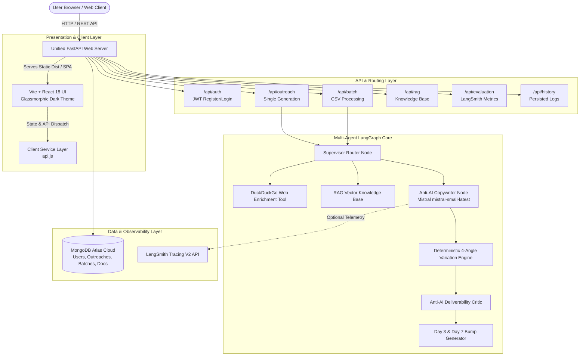
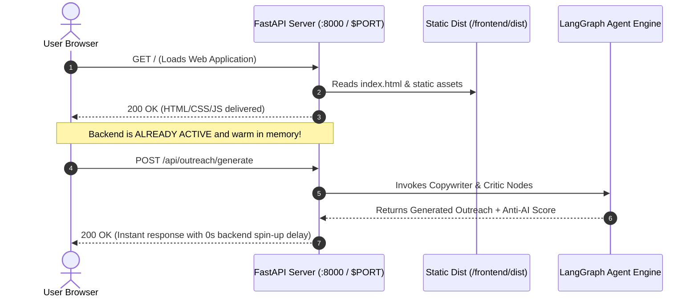
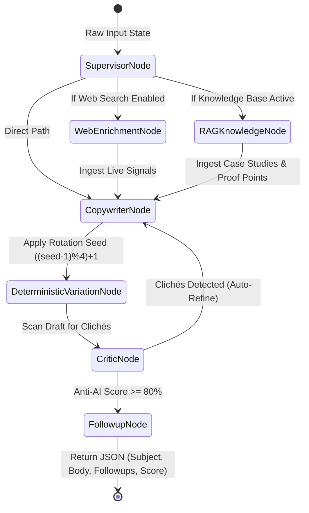
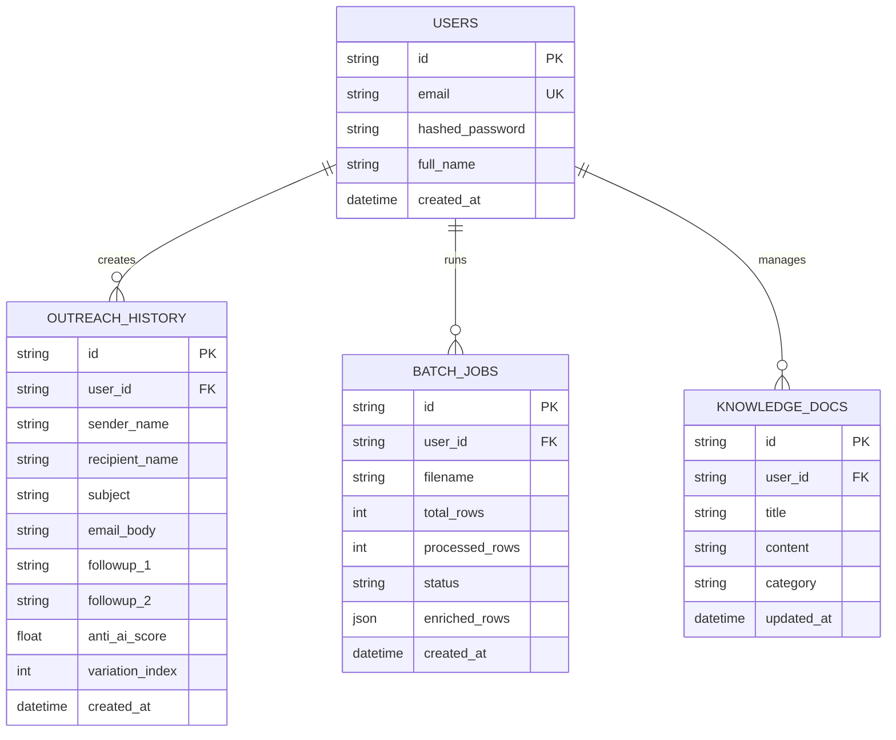
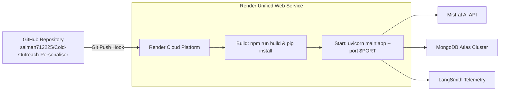

# 🏗️ ColdReach.ai — Architecture Documentation

> **Comprehensive architectural specification of the Cold Outreach Personaliser system, covering multi-agent orchestration, entity disambiguation, unified serving, data models, and cloud persistence.**

---

## 📑 Table of Contents
1. [High-Level System Architecture](#1-high-level-system-architecture)
2. [Component Breakdown](#2-component-breakdown)
3. [Unified Zero-Delay Serving Architecture](#3-unified-zero-delay-serving-architecture)
4. [Multi-Agent LangGraph Node System](#4-multi-agent-langgraph-node-system)
5. [Entity Disambiguation Architecture (From vs. To)](#5-entity-disambiguation-architecture-from-vs-to)
6. [Anti-AI Deliverability Scoring Engine](#6-anti-ai-deliverability-scoring-engine)
7. [Database Schema & Persistence (MongoDB Atlas)](#7-database-schema--persistence-mongodb-atlas)
8. [Security & Authentication Model](#8-security--authentication-model)
9. [Deployment Architecture](#9-deployment-architecture)

---

## 1. High-Level System Architecture

ColdReach.ai employs an asynchronous, unified full-stack architecture combining a reactive single-page application (SPA) with a multi-agent Python backend powered by **FastAPI**, **Mistral AI**, **LangGraph**, and **MongoDB Atlas**.



---

## 2. Component Breakdown

| Layer | Technology | Primary Responsibilities |
| :--- | :--- | :--- |
| **Frontend UI** | React 18, Vite, Tailwind CSS, Lucide Icons | Responsive glassmorphic interface, From/To dual card inputs, clickable subject line selection, live human score meters, CSV drag-and-drop table preview. |
| **API Server** | FastAPI (Python 3.10+), Uvicorn, Pydantic V2 | Async route handling, request validation, static SPA mounting, background task worker management, JWT auth. |
| **LLM Reasoning** | Mistral AI (`mistral-small-latest`) | High-speed, nuanced natural language generation with strict anti-sycophancy negative constraints. |
| **Agent Graph** | LangGraph & Multi-Agent State Graph | State propagation across Supervisor, Web Enrichment, Copywriter, and Critic nodes. |
| **Data Layer** | MongoDB Atlas, Motor (Async Driver) | Persistent storage for users, generation history, batch job states, and RAG company knowledge docs. |
| **Telemetry** | LangSmith (Optional) | End-to-end trace collection, latency profiling, token metrics, and evaluation scoring. |

---

## 3. Unified Zero-Delay Serving Architecture

In conventional multi-tier architectures, the frontend is hosted on a static CDN while the backend runs as a separate web service that spins down during periods of inactivity (incurring 50–90 second cold-start delays).

ColdReach.ai eliminates this cold-start penalty using a **Unified Static Serving Architecture**:



### Key Technical Advantages:
1. **Zero Cold-Start Lag**: Visiting the website triggers the backend container immediately.
2. **Zero CORS Overhead**: Frontend and API share the exact same origin (`window.location.origin`).
3. **Single Container Footprint**: Deploys as 1 unified web service on Render, Docker, or AWS.

---

## 4. Multi-Agent LangGraph Node System

The core generation pipeline operates as a directed acyclic graph (DAG) managed via `OutreachState`:



### State Schema (`OutreachState`)
```python
class OutreachState(TypedDict):
    # Sender (From) Entity
    sender_name: str
    sender_role: str
    sender_company: str
    
    # Recipient (To) Entity
    recipient_name: str
    recipient_role: str
    recipient_company: str
    
    # Context & Configuration
    profile_text: str
    tone: str
    goal: str
    value_proposition: str
    variation_count: int
    
    # Intermediate Artifacts
    enriched_signals: list[str]
    retrieved_case_studies: list[str]
    
    # Final Outputs
    subject_options: list[str]
    selected_subject: str
    email_body: str
    followup_1: str
    followup_2: str
    anti_ai_score: float
    detected_cliches: list[str]
```

---

## 5. Entity Disambiguation Architecture (From vs. To)

To eliminate common LLM naming hallucinations (e.g., calling the recipient by the user's name), ColdReach.ai enforces explicit separation throughout the data lifecycle:

```
[ USER INPUT FORM ]
  ├── 1. FROM (Sender):
  │      ├── Name    : "Mohammed Salman"
  │      ├── Role    : "B.Tech CSE Student"
  │      └── College : "Crescent Institute"
  │
  └── 2. TO (Recipient):
         ├── Name    : "Dr. Sharma"
         ├── Role    : "HOD & Professor"
         └── Company : "Crescent Institute"
              │
              ▼
[ ENTITY DISAMBIGUATION MAPPER ]
  ├── Greeting / Salutation  ➔ Strictly maps to Recipient ("Respected Dr. Sharma,")
  ├── Hook / Context Context ➔ Contextualized around Recipient's domain
  ├── Proof Point / Value    ➔ Self-introduction of Sender's credentials
  └── Sign-Off & Signature   ➔ Strictly maps to Sender ("Sincerely, Mohammed Salman \n B.Tech CSE Student")
```

---

## 6. Anti-AI Deliverability Scoring Engine

The Critic node computes a composite score (0–100%) based on 3 primary vectors:

$$ \text{Anti-AI Score} = 100 - (\text{Cliché Penalty}) - (\text{Length Penalty}) + (\text{Conversational Bonus}) $$

### Scoring Penalties:
- **Cliché Penalty**: $-12\%$ per detected token (e.g., *"delve"*, *"supercharge"*, *"testament"*, *"in today's fast-paced world"*).
- **Robotic Opener Penalty**: $-20\%$ if starting with *"I hope this email finds you well"*.
- **Length Penalty**: $-10\%$ if word count exceeds 160 words (penalizing bloated text).
- **Conversational Readability Bonus**: $+10\%$ for 6th–8th grade Flesch-Kincaid reading levels.

---

## 7. Database Schema & Persistence (MongoDB Atlas)



---

## 8. Security & Authentication Model

- **JWT Bearer Token Authentication**: HS256 algorithm with 24-hour expiration tokens stored in `localStorage`.
- **Password Security**: Passlib with bcrypt hashing.
- **Guest Fallback**: Single generation and batch jobs remain accessible in guest mode with graceful in-memory storage.
- **Data Isolation**: Multi-tenant database queries filter documents strictly by `user_id`.

---

## 9. Deployment Architecture


