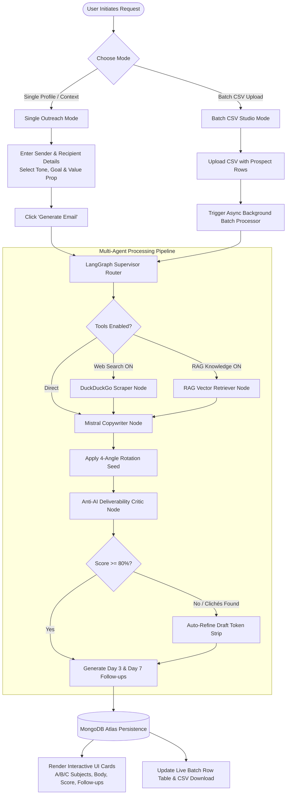
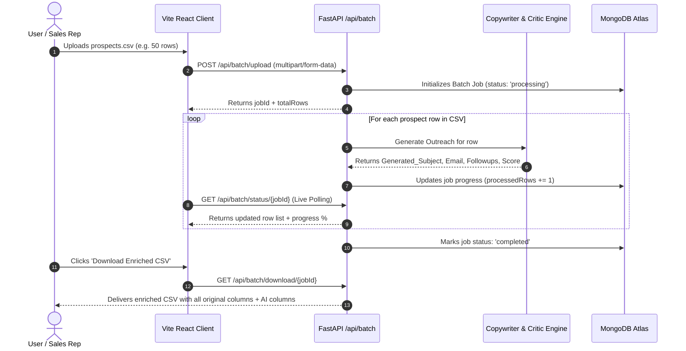
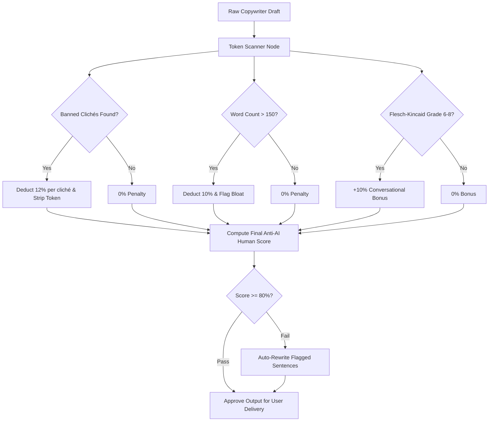
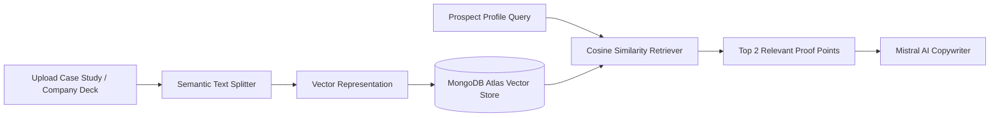
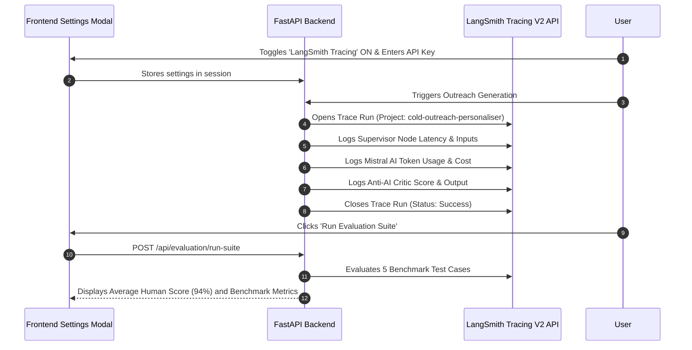
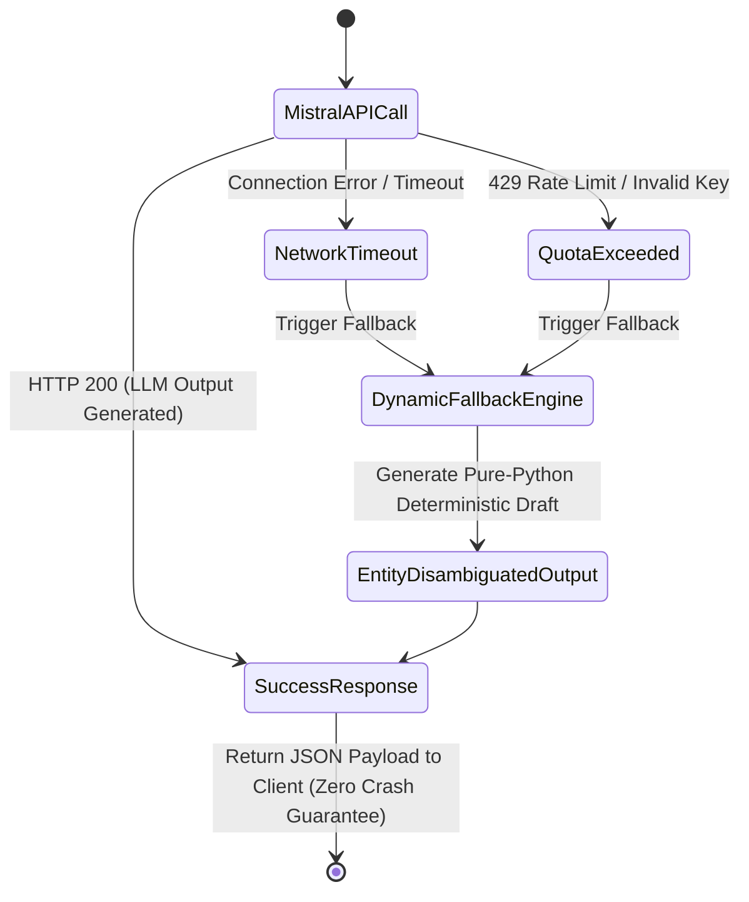

# 🔄 ColdReach.ai — Workflow Documentation

> **Complete operational workflows, data lifecycles, state machine diagrams, and step-by-step generation sequences for ColdReach.ai.**

---

## 📑 Table of Contents
1. [End-to-End System Workflow](#1-end-to-end-system-workflow)
2. [Single Outreach Execution Lifecycle](#2-single-outreach-execution-lifecycle)
3. [Batch CSV Processing Workflow](#3-batch-csv-processing-workflow)
4. [4-Angle Deterministic Variation State Machine](#4-4-angle-deterministic-variation-state-machine)
5. [Anti-AI Deliverability Critic & Refinement Loop](#5-anti-ai-deliverability-critic--refinement-loop)
6. [RAG Knowledge Base & Proof Point Ingestion](#6-rag-knowledge-base--proof-point-ingestion)
7. [LangSmith Telemetry & Evaluation Flow](#7-langsmith-telemetry--evaluation-flow)
8. [Error Handling & Fallback State Machine](#8-error-handling--fallback-state-machine)

---

## 1. End-to-End System Workflow



---

## 2. Single Outreach Execution Lifecycle

### Step 1: Input Ingestion & Form Validation
The user specifies two distinct sets of parameters:
1. **FROM (Sender / Your Details)**: Name (e.g., `Mohammed Salman`), Role (`B.Tech CSE Student`), Organization (`Crescent Institute`).
2. **TO (Recipient / Prospect Details)**: Name (e.g., `Dr. Sharma`), Role (`HOD & Professor`), Organization (`Crescent Institute`).
3. **Context Parameters**:
   - **Tone**: Formal Academic, Casual Peer, Value-First Exec, Friendly Colleague.
   - **Goal**: Leave Application, Job Application, Partnership, Advisory Request.
   - **Value Proposition / Core Reason**: Specific medical leave reason, quantified project metric, or business proposition.

### Step 2: Supervisor & Entity Routing
The backend validates request payloads against Pydantic V2 models and dispatches the data to the LangGraph supervisor.

### Step 3: Anti-AI Copywriting & Negative Constraints
Mistral AI (`mistral-small-latest`) generates the draft under strict negative constraints:
- 🚫 Zero robot openers (*"I hope this email finds you well"*).
- 🚫 Zero buzzwords (*"delve"*, *"supercharge"*, *"unleash"*, *"cutting-edge"*).
- 🚫 Maximum 120–140 words for business outreach; formal structured paragraphs for academic applications.

### Step 4: Output Assembly
The engine returns:
- **3 Dynamic Subject Lines (A / B / C)** (e.g., Option A: Formal, Option B: Short Hook, Option C: Direct Action).
- **Primary Body Content** with verified recipient greeting and sender sign-off.
- **Day 3 & Day 7 Follow-up Messages**.
- **Live Anti-AI Deliverability Human Score (0–100%)**.

---

## 3. Batch CSV Processing Workflow



---

## 4. 4-Angle Deterministic Variation State Machine

Clicking **"Generate New Variation (#2, #3, #4)"** cycles deterministically through four distinct structural angles to ensure genuine variety:

```mermaid
stateDiagram-v2
    [*] --> Variation_1: Initial Click (Seed = 1)
    
    Variation_1 --> Variation_2: Click 'New Variation (#2)'
    note right of Variation_1: Angle 1: Direct Core Action\nClear, immediate upfront request or claim.
    
    Variation_2 --> Variation_3: Click 'New Variation (#3)'
    note right of Variation_2: Angle 2: Evidence & Proof Point Focus\nLead with quantified metrics or medical facts.
    
    Variation_3 --> Variation_4: Click 'New Variation (#4)'
    note right of Variation_3: Angle 3: Peer & Collaborative Angle\nFocus on smooth handover, notes, or team sync.
    
    Variation_4 --> Variation_1: Click 'New Variation (#5)'
    note right of Variation_4: Angle 4: Time-Bound & Concise Summary\nUltra-brief, 3-sentence high-efficiency draft.
```

### Mathematical Seed Rotation Formula:
```python
variant_seed = ((variation_count - 1) % 4) + 1
```

---

## 5. Anti-AI Deliverability Critic & Refinement Loop



---

## 6. RAG Knowledge Base & Proof Point Ingestion



---

## 7. LangSmith Telemetry & Evaluation Flow



---

## 8. Error Handling & Fallback State Machine


